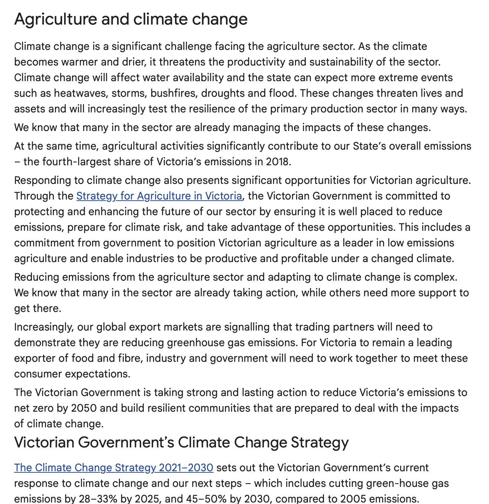

# NotebookLM Collaborative Learning Support

## Overview
This repository showcases the capabilities of NotebookLM in facilitating collaborative learning. The demonstration is based on a group project focused on "Agriculture and Climate Change" in Victoria, utilizing NotebookLM to enhance collaboration, note-taking, and resource sharing among team members.

## Table of Contents
- [Introduction](#introduction)
- [Process](#process)
- [Results](#results)
- [Screenshots](#screenshots)

## Introduction
Collaborative learning enables students to work together to enhance understanding and knowledge retention. NotebookLM provides tools that support collaboration by allowing multiple users to share notes, resources, and insights in real-time.

## Process
1. **Project Setup**:
   - Created a shared workspace within NotebookLM for the group project on "Agriculture and Climate Change."
   - Invited team members to join the workspace.

2. **Resource Upload**:
   - Uploaded key documents, including the article "Agriculture and Climate Change - Agriculture Victoria" and relevant research papers.
   - Each team member was tasked with summarizing sections of the document and adding their insights.

3. **Note-Taking and Collaboration**:
   - Used NotebookLM's collaborative features to take notes in real-time during discussions.
   - Each user has their own chat threads that can be used simultaneously
   - They can write there own ideas, pose questions, summarise key findings etc. and save them to the Notebook workspace
   - This allows everyone to leverage same knowledge base of content

4. **Review and Feedback**:
   - After initial note-taking, the group reviewed each other's contributions and provided feedback directly within NotebookLM.
   - Discussed and revised notes based on group consensus.

5. **Finalizing Notes**:
   - Compiled the organized notes into a structured document for submission, ensuring all sections were coherent and informative.

## Results
- The collaborative efforts led to a comprehensive set of structured notes that included key themes and resources related to climate change and agriculture.
- NotebookLM facilitated seamless communication and feedback, improving the overall quality of the notes.
- The final document was well-organized, highlighting important concepts and providing references back to the original materials.

## Screenshots
Here are some screenshots demonstrating the collaboration process in NotebookLM:

1. **Inviting team members to join the workspace**:
   

2. **Real-time Note-Taking**:
   

3. **Workspace**:
   

4. **Final Organized Notes**:
   
