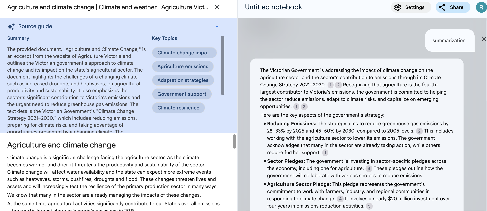

# Content Summarization with NotebookLM

This document demonstrates NotebookLM’s content summarization capabilities with a practical example and evaluation.

## Example Document

For this test, I used an article titled **"Agriculture and climate change - Agriculture Victoria."** by Department of Jobs, P. and R. (2021, May 2)
https://agriculture.vic.gov.au/climate-and-weather/policy-programs-action
‌

## Summary Generated by NotebookLM

The Victorian Government is undertaking a multi-pronged approach to address the challenges and opportunities presented by climate change in the agricultural sector.

* Climate change poses a significant threat to the agricultural sector, impacting water availability and leading to more extreme weather events.
* Agriculture is a major contributor to Victoria's overall emissions, making it crucial to reduce emissions and adapt to the changing climate.
* The Victorian Government recognizes the need to support farmers in their efforts to reduce emissions and adapt to climate change.
* The government's Climate Change Strategy 2021–2030 outlines a plan to achieve net-zero emissions by 2050. This strategy includes sector-specific pledges, such as the Agriculture Sector Pledge, to work collaboratively with industries on emission reduction and adaptation strategies.
* The Agriculture Sector Pledge, backed by almost $20 million over four years, focuses on developing a shared vision, conducting research, and providing farmers with tools and services to reduce emissions and maintain profitability.

  **Key components of the Agriculture Sector Pledge include**
  * Establishing a long-term vision for agriculture's role in a net-zero emissions economy.
  * Investing in research to develop emission reduction technologies and practices, including trials of methane-inhibiting feed additives and the development of the Ellinbank SmartFarm as a carbon-neutral dairy farm.
  * Providing farmers with information, tools, and services to support emission reduction, adaptation, and climate risk management, including on-farm action plans with grants for implementation.

* The Victorian Government also supports farmers in reducing emissions through other programs, such as the Agriculture Energy Investment Plan and the Victorian Carbon Farming Program.
* Recognizing the impact of climate change on primary industries, the government has released the Primary Production Adaptation Action Plan (AAP) to guide adaptation efforts.
* The Primary Production AAP, updated every five years, outlines the challenges and opportunities of climate change for the primary production sector, including agriculture, forestry, and fisheries. It also covers the entire value chain, from inputs to market delivery.
* The plan acknowledges the increasing challenges facing primary industries due to climate change and aims to guide them in reducing risks, building resilience, and seizing new opportunities.

  **The Primary Production AAP prioritizes actions addressing:**
  * Current and future climate risks, such as increased heat and reduced rainfall.
  * More frequent and severe extreme events like bushfires and floods.
  * The need for transformative changes to adapt to long-term climate change.
    
* The government is actively working to support adaptation by fostering partnerships, research, and innovation, and by building capacity within the primary industries to effectively respond to climate change.

In conclusion, the Victorian Government is committed to working alongside farmers and industry stakeholders to address the complexities of climate change in agriculture. Through a combination of research, innovation, support programs, and adaptation strategies, the government aims to build a more sustainable and resilient agricultural sector in the face of climate change.

## Screenshot

