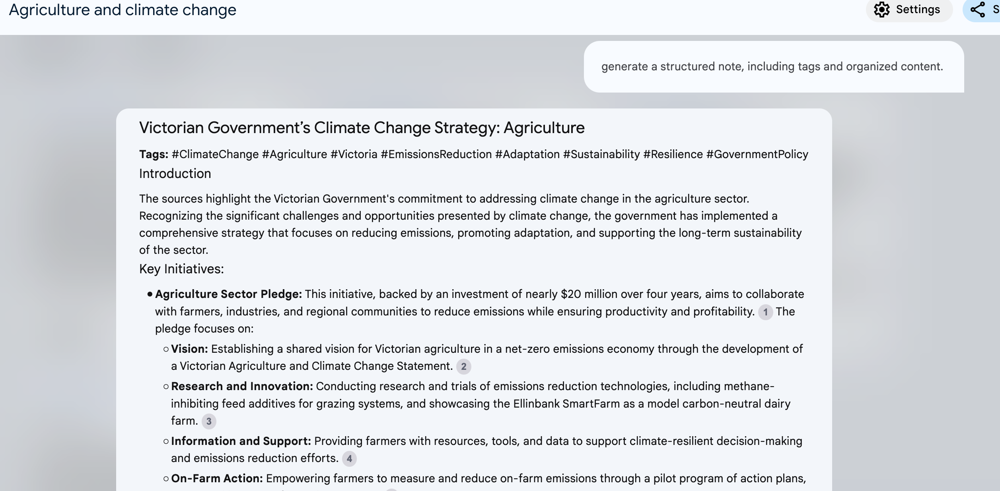

# Contextualized Note-Taking with NotebookLM

This document provides an example of how NotebookLM can facilitate contextualized note-taking by creating structured notes based on the article "Agriculture and climate change - Agriculture Victoria" by the Department of Jobs, P. and R. (2021).

## Example Document

For this test, I used an article titled "Agriculture and climate change - Agriculture Victoria." by Department of Jobs, P. and R. (2021, May 2) https://agriculture.vic.gov.au/climate-and-weather/policy-programs-action ‌
For this demonstration, the article outlines the Victorian Government's strategy for addressing climate change in the agricultural sector, with an emphasis on achieving resilience and net-zero emissions by 2050.

## Mind Map for Agriculture and Climate Change in Victoria

**Central Topic:** Agriculture and Climate Change in Victoria

**Main Branches:**

1.  **Climate Change Impacts**
    *   Warmer and drier climate
    *   Water scarcity
    *   Increased extreme weather events: heatwaves, storms, bushfires, droughts, floods
    *   Impacts on agricultural productivity
    *   Challenges to primary industries and government operations

2.  **Agriculture's Role in Emissions**
    *   Fourth-largest share of Victoria's emissions
    *   Need to reduce emissions from agricultural activities

3.  **Victorian Government Response**
    *   **Climate Change Strategy 2021–2030**
        *   Reduce greenhouse gas emissions (28–33% by 2025, 45–50% by 2030)
        *   Support adaptation for communities and industry
        *   Boost the economy and enhance quality of life
    *   **Sector Pledges**
        *   Including the **Agriculture Sector Pledge**
            *   Almost $20 million investment over four years
            *   Shared vision for emissions reduction
            *   Flagship research trials
            *   Tools and services for farmers
    *   **Other Programs and Support**
        *   BushBank Program
        *   Victorian Energy Upgrades
        *   Solar for Business Program
        *   **Agriculture Energy Investment Plan**
        *   **Victorian Carbon Farming Program**
        *   **Primary Production Adaptation Action Plan**

4.  **Adaptation and Mitigation Strategies**
    *   **Emissions Reduction**
        *   Developing a Victorian Agriculture and Climate Change Statement
        *   Research into emissions reduction technologies and practices
        *   Providing information and tools to support emissions reduction
        *   Supporting farmers to understand, measure, and reduce emissions
        *   **On-Farm Emissions Action Plan Pilot**
    *   **Adaptation and Climate Risk Management**
        *   Building tools for climate-resilient decision-making
        *   Providing foundational data and information
        *   **Primary Production Adaptation Action Plan**
            *   Focuses on building climate resilience in primary industries
            *   Facilitates research and innovation
            *   Supports information sharing and capacity building
            *   Addresses current and future risks and vulnerabilities
            *   Supports transformative adaptation
            *   Encourages partnerships for research and innovation

5.  **Key Goals and Outcomes**
    *   Reduce emissions and achieve net zero by 2050
    *   Build climate resilience in the agriculture sector
    *   Ensure the long-term viability and sustainability of agriculture
    *   Maintain productivity and profitability in a changing climate
    *   Position Victorian agriculture as a leader in low emissions agriculture
    *   Meet consumer expectations in export markets
    *   Create jobs and support economic recovery

This mind map visually represents the main ideas and connections within the provided sources about agriculture and climate change in Victoria. It highlights the impacts of climate change, the role of agriculture in emissions, the government's response, and the strategies for adaptation and mitigation. The mind map also underscores the goals of achieving net-zero emissions, building climate resilience, and ensuring the sustainability of Victorian agriculture.

## Evidence

